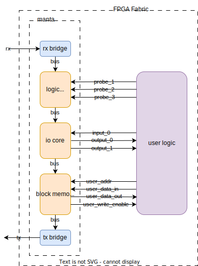
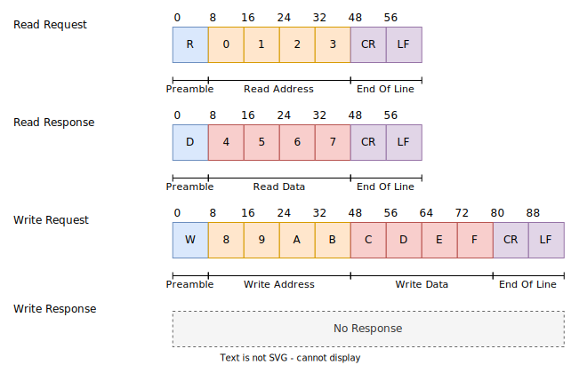
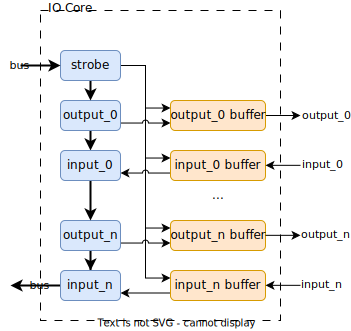
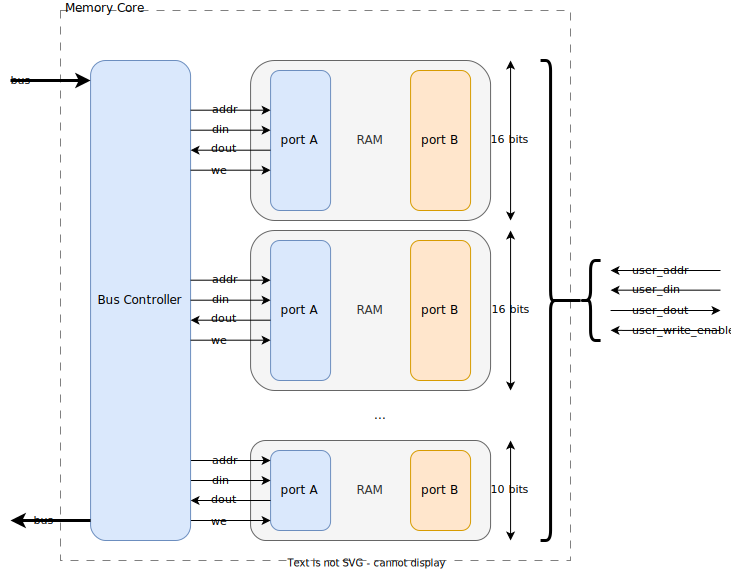

## System Architecture

The whole system looks like the following:

Manta consists of two parts - a Python API running on a host machine, and an autogenerated block of RTL that's included with your logic on a FPGA. Either UART or Ethernet is used for communication, which allows the host machine to operate the debugging cores on the FPGA.

## Manta Architecture

The logic Manta places on the FPGA consists of a series of cores connected in a chain along a common bus. Each core provides a unique method for interacting with the user’s logic, which it connects to by routing signals (called _probes_) between the user’s logic and the cores that interface with it.

These probes are presented as addressable memory, and are be controlled by reading and writing to their corresponding memory - not unlike registers on a microcontroller. Each core is allotted a section of address space at compile time, and operations addressed to a core’s address space control the behavior of the core. These cores are then daisy-chained along an internal bus, which permits a chain arbitrarily many cores to be placed on the bus.

At the beginning of this chain is a module called a _receive bridge_, which converts incoming UART/Ethernet communication from the host into read and write requests, which are placed on the bus. These are called _bus transactions_, and once placed on the bus, they travel through each core before reaching the _transmit bridge_ at the end of the chain. This module places the result of the bus transaction back on the UART/Ethernet interface, and sends it back to the host. This produces a request-response style of communication between the host machine and the FPGA.

## Data Bus

The data bus is designed for simplicity, and consists of five signals used to perform reads and writes on memory:

- `addr [15:0]`, indicating the memory address targeted by the current transaction.
- `data [15:0]`, which data is read from during a read, or written to during a write.
- `rw`, indicating a read or write transaction if the signal is low or high respectively.
- `valid`, which is driven high only when the operation specified by the other signals is to be executed.

Each core has a bus input and output port, so that cores can be daisy-chained together. When it receives an incoming bus transaction (signalled by `valid`), the core checks the address on the wire against its own memory space. If the address lies within the core, the core will perform the requested operation against its own memory space. In the case of a read, it places the data at that address on `data`, and in the case of a write, it copies the value of `data` to the specified location in memory. However, if the address lies outside of the memory of the core, then no operations are performed.

{.svg-container}
{.svg-container}

## Message Format

Ethernet and UART both allow a stream of bytes to be sent between the host and FPGA, but since they're just interfaces, they don't define how these bytes are structured. As a result, Manta implements its own messaging format, with the following structure:

Each of these messages is a string of ASCII characters consisting of a preamble, optional address and data fields, and an End of Line (EOL). The preamble denotes the type of operation, _R_ for a read and _W_ for a write. The address and data fields are encoded as hexadecimal digits, represented with the characters 0-9 and A-F in ASCII. As a result, four characters are needed to encode a 16-bit address or 16-bits of data. If the message specifies a write request, then it will contain a data field after the address field. Both request types will conclude with an End of Line, which consists of the two ASCII characters indicating a Carriage Return (CR) and a Line Feed (LF).

These requests are sent by the host machine to the FPGA, which reads them from the `rx` line on the interface transceiver. This is handled by the receive bridge, which parses incoming messages, and generates bus transactions from them. Once this transaction runs through every core in the chain, it arrives at the transmit bridge, which may send a response back to the host over the `tx` line.

If the request specified a read operation, then a response will be produced. These responses have the same structure as the read request itself, albeit with the data read from memory substituted in place of the address. This results in a message of the same length, just with the address swapped for data. If the request specified a write operation, then no response will be sent back to the host. Manta provides no report of if the write was successful - if a write operation must be verified, Manta will just perform a read operation on the same address location and check the value.

An example of some bus traffic is provided below:

| Sequence Number | Interface Activity              | Operation               |
|-----------------|---------------------------------|-------------------------|
| 1               | Host → FPGA: R1234(CR)(LF)      | -                       |
| 2               | FPGA → Host: R5678(CR)(LF)      | Read 0x5678 from 0x1234 |
| 3               | Host → FPGA: WF00DBEEF(CR)(LF)  | Write 0xBEEF to 0xF00D  |
| 4               | Host → FPGA: RF00D(CR)(LF)      | -                       |
| 5               | FPGA → Host: RBEEF(CR)(LF)      | Read 0xBEEF from 0xF00D |
| 6               | Host → FPGA: W12340000(CR)(LF)  | Write 0x0000 to 0x1234  |

When UART is used, these bytes are transmitted directly across the wire, but when Ethernet is used, they're packed into the packet's payload field.

# Cores

## IO Core

This is done with the architecture shown below:

Each of the probes is mapped to a register of Manta's internal memory. Since Manta's internal registers are 16 bits wide, probes less than 16 bits are mapped to a single register, but probes wider than 16 bits require multiple.

Whatever the number of registers required, these are read from and written to by the host machine - but the connection to the user's logic isn't direct. The value of each probe is buffered, and only once the `strobe` register has been set to one will the buffers update. When this happens, output probes provide new values to user logic, and new values for input probes are read from user logic. This provides a convenient place to perform clock domain crossing, and also mitigates the possibility of an inconsistent system state. This is explained in more detail in Chapter 3.6 of the [original thesis](thesis.pdf).

## Logic Analyzer
The Logic Analyzer Core's implementation on the FPGA consists of three primary components:

- The _Finite State Machine (FSM)_, which controls the operation of the core. The FSM's operation is driven by its associated registers, which are placed in a separate module. This permits simple CDC between the bus and user clock domains.
- The _Trigger Block_, which generates the core's trigger condition. The trigger block contains a trigger for each input probe, and the registers necessary to configure them. It also contains the $N$-logic gate (either AND or OR) that generates the core's trigger from the individual probe triggers. CDC is performed in exactly the same manner as the FSM. If an external trigger is specified, the trigger block is omitted from the Logic Analyzer Core, and the external trigger is routed to the FSM's `trig` input.
- The _Sample Memory_, which stores the states of the probes during a capture. This is implemented as a dual-port, dual-clock block memory, with the bus on one port and the probes on the other. The probe-connected port only writes to the memory, with the address and enable pins managed by the FSM. CDC is performed in the block RAM primitive itself.

## Memory Core

Each Memory core is actually a set of 16-bit wide BRAMs with their ports concatenated together, with any spare bits masked off. Here's a diagram:

Since each $n$-bit wide block memory is actually $ceil(n/16)$ BRAMs under the hood, addressing the BRAMs correctly from Manta's internal bus is important. BRAMs are organized such that each 16-bit slice of a $N$-bit word in the Block Memory core are placed next to each other in bus address space. For instance, a 34-bit wide block memory would exist on Manta's internal bus as:

| Bus Address Space           | BRAM Address Space   |
| -----------                 | -------------------- |
| BASE_ADDR + 0               | address 0, bits 0-15 |
| BASE_ADDR + 1               | address 1, bits 0-15 |
| BASE_ADDR + n               | address n, bits 0-15 |
| ...                         | ...                  |
| BASE_ADDR + 0 + DEPTH       | address 0, bits 16-31|
| BASE_ADDR + 1 + DEPTH       | address 1, bits 16-31|
| BASE_ADDR + n + DEPTH       | address n, bits 16-31|
| ...                         | ...                  |
| BASE_ADDR + 0 + (2 * DEPTH) | address 0, bits 32-33|
| BASE_ADDR + 1 + (2 * DEPTH) | address 1, bits 32-33|
| BASE_ADDR + n + (2 * DEPTH) | address n, bits 32-33|
| ...                         | ...                  |

...and so on.
