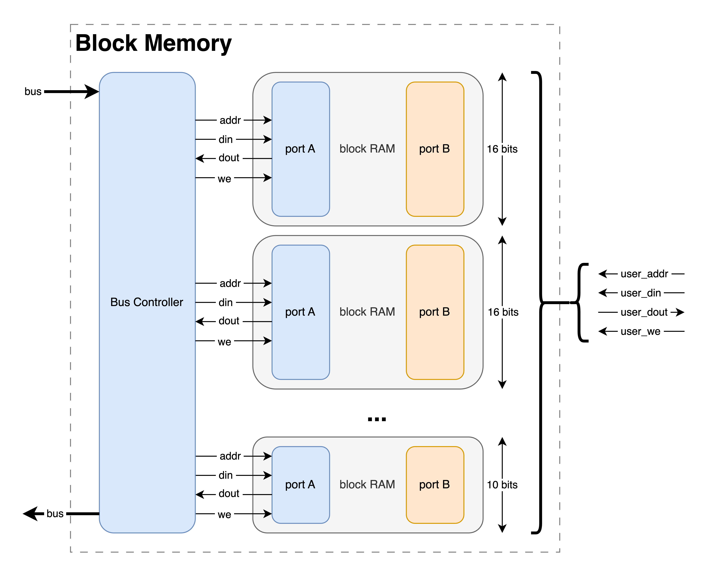

## Overview
Block Memory (also called Block RAM, or BRAM) is the de facto means of storing data on FPGAs when the space needed exceeds a few registers. As a result, Manta provides a Block Memory core, which instantiates a dual-port BRAM on the FPGA. One port is provided to the host, and the other is connected to your logic with the standard BRAM interface (`addr`, `din`, `dout`, `wea`). This allows the host to provide reasonably large amounts of data to user logic - or the other way around, or a mix of both!

This is a very, very simple task - and while configuration is straightforward, there are a few caveats. More on both topics below:

## Configuration

Just like the rest of the cores, the Block Memory core is configured via an entry in a project's configuration file. This is easiest to show by example:

```yaml
---
cores:
  my_block_memory:
    type: block_memory
    width: 12
    depth: 16384

```

There's a few parameters that get configured here, including:

- `name`: The name of the Block Memory core. This name is used to reference the core when working with the API, and can be whatever you'd like.
- `type`: This denotes that this is a Block Memory core. All cores contain a `type` field, which must be set to `block_memory` to be recognized as an Block Memory core.

### Dimensions
The dimensions of the block memory are specified in the config file with the `width` and `depth` entries.

Manta won't impose any limit on the width or depth of the block memory you instantiate, but since Manta instantiates BRAM primitives on the FPGA, you will be limited by what your FPGA can support. It helps to know your particular FPGA's architecture here.

If your BRAM is more than 16 bits wide, check out the section on [Synchronicity](#synchronicity) and make sure your project will tolerate how Manta writes to the block memory.


### Python API

The Block Memory core functionality is stored in the `Manta.IOCore` and `Manta.IOCoreProbe` classes in [src/manta/io_core/\_\_init\_\_.py](https://github.com/fischermoseley/manta/blob/main/src/manta/io_core/__init__.py), and it may be controlled with the two functions:

Just like with the other cores, interfacing with the BRAM with the Python API is simple:

```python
from manta import Manta
m = manta('manta.yaml')

m.my_block_memory.write(addr=38, data=600)
m.my_block_memory.write(addr=0x1234, data = 0b100011101011)
m.my_block_memory.write(0x0612, 0x2001)

foo = m.my_block_memory.write(addr=38)
foo = m.my_block_memory.write(addr=1234)
foo = m.my_block_memory.write(0x0612)
```

Reading/writing in batches is also supported. This is recommended where possible, as reads are massively sped up by performing them in bulk:

```python
addrs = list(range(0, 1234))
datas = list(range(1234, 2468))
m.my_block_memory.write(addrs, datas)

foo = m.my_block_memory.read(addrs)
```

### Examples

A Block Memory core is used in the [video_sprite](https://github.com/fischermoseley/manta/blob/main/examples/nexys_a7/video_sprite) example. This uses the core to store a 128x128 image sprite in 12-bit color, and outputs it to a VGA display at 1024x768. The sprite contents can be filled with an arbitrary image using the [send_image.py](https://github.com/fischermoseley/manta/blob/main/examples/nexys_a7/video_sprite/send_image.py) python script.

## Under the Hood

Each Block Memory core is actually a set of 16-bit wide BRAMs with their ports concatenated together, with any spare bits masked off. Here's a diagram:



This has one major consequence: if the core doesn't have a width that's an exact multiple of 16, synthesis engines (Vivado in particular) will throw some warnings as they optimize out the unused bits. This is expected behavior, and while the warnings are a little annoying, not having to manually deal with the unused bits simplifies the implementation immensely. No Python is needed to generate the core, and it'll configure itself just based on Verilog parameters. This turns the block memory core from a complicated conditionally-instantiated beast to a simple ~_100 line_ [Verilog file](https://github.com/fischermoseley/manta/blob/main/src/manta/block_memory.v).

### Address Assignment

Since each $n$-bit wide block memory is actually $ceil(n/16)$ BRAMs under the hood, addressing the BRAMs correctly from Manta's internal bus is important. BRAMs are organized such that each 16-bit slice of a $N$-bit word in the Block Memory core are placed next to each other in bus address space. For instance, a 34-bit wide block memory would exist on Manta's internal bus as:

| Bus Address Space | BRAM Address Space   |
| -----------       | -------------------- |
| BASE_ADDR + 0     | address 0, bits 0-15 |
| BASE_ADDR + 1     | address 0, bits 16-31|
| BASE_ADDR + 2     | address 0, bits 32-33|
| BASE_ADDR + 3     | address 1, bits 0-15 |
| BASE_ADDR + 4     | address 1, bits 16-31|
| BASE_ADDR + 5     | address 1, bits 32-33|

...and so on.

### Synchronicity

Since Manta's [data bus](../system_architecture) is only 16-bits wide, it's only possible to manipulate the BRAM core in 16-bit increments. This means that if you have a BRAM that's ≤16 bits wide, you'll only need to issue a single bus transaction to read/write one entry in the BRAM. However, if you have a BRAM that's ≥16 bits wide, you'll need to issue a bus transaction to update each 16-bit slice of it. For instance, updating a single entry in a 33-bit wide BRAM would require sending 3 messages to the FPGA: one for bits 1-16, another for bits 17-32, and one for bit 33. If your application expects each BRAM entry to update instantaneously, this could be problematic.

There's a few different ways to solve this - you could use an IO core to signal when a BRAM's contents or valid - or you could ping-pong between two BRAMs while one is being modified. The choice is yours, and Manta makes no attempt to presribe any particular approach.

Lastly, the interface you use (and to a lesser extent, your operating system) will determine the space between bus transactions. For instance, 100Mbit Ethernet is a thousand times faster than 115200bps UART, so the time where the BRAM is invalid is a thousand times smaller.
