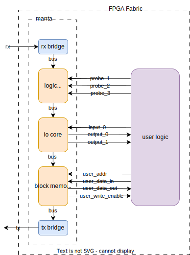
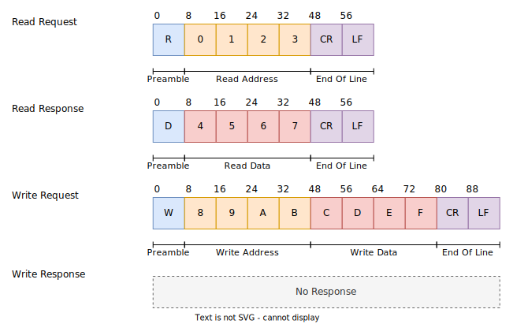

## System Architecture

The whole system looks like the following:

{:style="width:80%"}

Manta is operated via its Python API, which communicates with the connected FPGA over an interface API like `pySerial` or `Scapy`. These abstract away the OS device drivers, which function differently depending on the host machine's platform. The OS device drivers ultimately send out bytes to the FPGA, across either a USB or Ethernet cable.

Once sent across the wire, bytes are picked up by an interface transciever on the FPGA development board. This is either a USB-UART converter or a RMII PHY depending on if you're using UART or Ethernet. This chip is connected to the FPGA's IO, which routes the signals to the Verilog module generated by Manta. This module parses incoming messages, passes them down a set of daisy-chained cores, and then packetizes it and sends it back to the host.

## Manta Architecture

The logic Manta places on the FPGA consists of a series of cores connected in a chain along a common bus. Each core provides a unique method for interacting with the user’s logic, which it connects to by routing signals (called _probes_) between the user’s logic and the cores that interface with it.

{:style="width:40%"}

These probes are presented as addressable memory, and are be controlled by reading and writing to their corresponing memory - not unlike registers on a microcontroller. Each core is allotted a section of address space at compile time, and operations addressed to a core’s address space control the behavior of the core. These cores are then daisy-chained along an internal bus, which permits a chain arbitrarily many cores to be placed on the bus.

At the beginning of this chain is a module called a _receive bridge_, which converts incoming UART/Ethernet communication from the host into read and write requests, which are placed on the bus. These are called _bus transactions_, and once placed on the bus, they travel through each core before reaching the _transmit bridge_ at the end of the chain. This module places the result of the bus transaction back on the UART/Ethernet interface, and sends it back to the host. This produces a request-response style of communication between the host machine and the FPGA.

## Data Bus

The data bus is designed for simplicity, and consists of five signals used to perform reads and writes on memory:

- `addr [15:0]`, indicating the memory address targeted by the current transaction.
- `data [15:0]`, which data is read from during a read, or written to during a write.
- `rw`, indicating a read or write transaction if the signal is low or high respectively.
- `valid`, which is driven high only when the operation specified by the other signals is to be executed.

Each core has a bus input and output port, so that cores can be daisy-chained together. When it receives an incoming bus transaction (signalled by `valid`), the core checks the address on the wire against its own memory space. If the address lies within the core, the core will perform the requested operation against its own memory space. In the case of a read, it places the data at that address on `data`, and in the case of a write, it copies the value of `data` to the specified location in memory. However, if the address lies outside of the memory of the core, then no operations are performed.

{:style="width:49%"}
{:style="width:49%"}

## Message Format

Ethernet and UART both allow a stream of bytes to be sent between the host and FPGA, but since they're just interfaces, they don't define how these bytes are structured. As a result, Manta implements its own messaging format, with the following structure:

{:style="width:85%"}

Each of these messages is a string of ASCII characters consisting of a preamble, optional address and data fields, and an End of Line (EOL). The preamble denotes the type of operation, _R_ for a read and _W_ for a write. The address and data fields are encoded as hexadecimal digits, represented with the characters 0-9 and A-F in ASCII. As a result, four characters are needed to encode a 16-bit address or 16-bits of data. If the message specifies a write request, then it will contain a data field after the address field. Both request types will conclude with an End of Line, which consists of the two ASCII characters indicating a Carriage Return (CR) and a Line Feed (LF).

These requests are sent by the host machine to the FPGA, which reads them from the `rx` line on the interface transceiver. This is handled by the receive bridge, which parses incoming messages, and generates bus transactions from them. Once this transaction runs through every core in the chain, it arrives at the transmit bridge, which may send a response back to the host over the `tx` line.

If the request specified a read operation, then a response will be produced. These responses have the same structure as the read request itself, albeit with the data read from memory substituted in place of the address. This results in a message of the same length, just with the address swapped for data. If the request specified a write operation, then no response will be sent back to the host. Manta provides no report of if the write was successful - if a write operation must be verified, Manta will just perform a read operation on the same address location and check the value.

An example of some bus traffic is provided below:

| Sequence Number | Interface Activity              | Operation               |
|-----------------|---------------------------------|-------------------------|
| 1               | Host → FPGA: R1234(CR)(LF)      | -                       |
| 2               | FPGA → Host: R5678(CR)(LF)      | Read 0x5678 from 0x1234 |
| 3               | Host → FPGA: WF00DBEEF(CR)(LF)  | Write 0xBEEF to 0xF00D  |
| 4               | Host → FPGA: RF00D(CR)(LF)      | -                       |
| 5               | FPGA → Host: RBEEF(CR)(LF)      | Read 0xBEEF from 0xF00D |
| 6               | Host → FPGA: W12340000(CR)(LF)  | Write 0x0000 to 0x1234  |

When UART is used, these bytes are transmitted directly across the wire, but when Ethernet is used, they're packed into the packet's payload field.