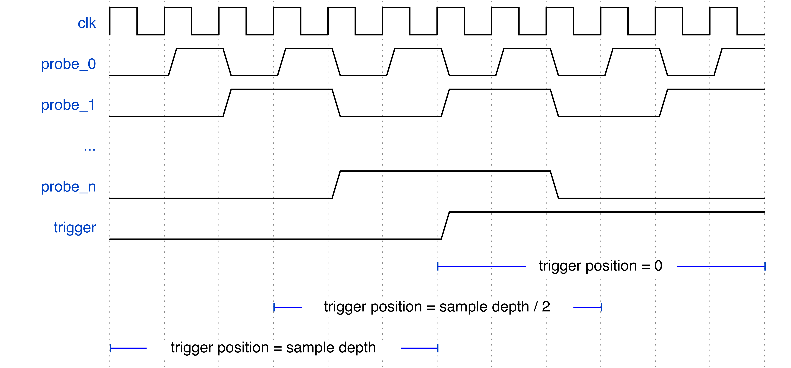

## Overview

The Logic Analyzer core allows for debugging logic by capturing a set of digital signals to memory. This is done in response to a ___trigger___ condition, which starts the ___capture___, which continues until the onboard memory is full, and the resulting capture is then read out to the user.

While this is pretty much identical to the behavior of a benchtop logic analyzer, Manta has a few tricks up its sleeve that you may find useful! These are described below:

## Configuration

Just like the rest of the cores, the Logic Analyzer core is configured via an entry in a project's configuration file. This is easiest to show by example:

```yaml
---
cores:
  my_logic_analyzer:
    type: logic_analyzer
    sample_depth: 4096
    trigger_loc: 1000

    probes:
      larry: 1
      curly: 3
      moe: 9

    triggers:
      - moe RISING
      - curly FALLING
```

There's a few parameters that get configured here, including:

- `name`: The name of the Logic Analyzer core. This name is used to reference the core when working with the API, and can be whatever you'd like.
- `type`: This denotes that this is a Logic Analyzer core. All cores contain a `type` field, which must be set to `logic_analyzer` to be recognized as an Logic Analyzer core.

### Sample Depth
This refers to the number of samples saved in the capture, and is set with the `sample_depth` entry in the config file. A larger sample depth will use more resources, but show what your probes are doing over a longer time.

### Probes
Probes are the signals in your logic that the Logic Analyzer connects to, and are specified in the `probes` entry of the config file. Each probe requires both a name and a width to be specified. These names can be whatever you'd like, however they are referenced in the autogenerated Verilog - so don't use something your synthesis engine won't appreciate.

### Triggers
Triggers are the conditions that your logic must meet in order to start a capture, and they're specified under the `triggers` entry in the config file. Manta's triggers are reprogrammable, meaning you don't need to rebuild your source code to change the trigger condition - just updating the configuration file is enough. If multiple triggers are provided, any one trigger being met will trigger the entire core.

Each individual trigger is specified with the following structure:

`[probe]` `[operation]` `[argument]`

- __probe__: The probe that the trigger applies to. Each probe only supports one trigger on it. For instance, in the example above we couldn't add a trigger for `curly LEQ 4`, since we've already assigned a trigger to `curly`.

- __operation__: The logical operation to perform. Manta supports the following operations:
    - `RISING`, which checks if the probe has increased in value since the last clock cycle.
    - `FALLING`, which checks if the probe has decreased in value since the last clock cycle.
    - `CHANGING`, which checks if the probe is changed in value since the last clock cycle.

    These operations only compare a probe's value with itself, but sometimes it is useful to compare a probe's value to a constant. Manta provides a operations for doing such, including:

    - `GT`,  for greater than.
    - `LT`,  for less than.
    - `GEQ`, for greater than or equal to.
    - `LEQ`, for less than or equal to.
    - `EQ`, for equal to.
    - `NEQ`, for not equal to.

    These operations require a constant to compare against, referred to as an _argument_, which is descirbed below:

- __argument__: A constant to compare against, if the operation specified requires one. On the FPGA, the argument will have just as many bits as the probe width.

Lastly, if you're not able to express your desired trigger condition in terms of the operators above, fear not! You can also specifiy an `external_trigger: true` entry in the config file, which exposes an input on Manta's top level for your own trigger.

### Trigger Position (optional)
Sometimes, you care more about what happens before a trigger is met than afterwards, or vice versa. To accomodate this, the logic analyzer has an optional _Trigger Position_ parameter, which sets when probe data is captured relative to the trigger condition being met. This is specified with the `trigger_position` entry in the configuration file, which sets how many samples to save prior to the trigger condition occuring. This is best explained with a picture:

{style="width:90%"}

The windows at the bottom of the diagram show what portions of the timeseries will be captured for different trigger positions. For instance:

- A trigger position of half the sample depth centers the capture window around when the trigger condition is met.
- A trigger position of zero places the trigger at the zeroth clock cycle of the capture.
- A trigger position equal to the sample depth causes the trigger to occur on the last sample in the capture.

If `trigger_position` is not specified, Manta will default to centering the capture window around the trigger condition.

### Capture Modes (optional)
The logic analyzer has a few different ways of capturing data, which are represented by the _capture modes_ below:

- __Single-Shot__: Once the trigger condition is met, record the value of the probes on every clock cycle in a continuous single shot.
- __Incremental__: Record samples when the trigger condition is met, but __don't__ record the samples when the trigger condition is not met. This is super useful for applications like audio processing or memory controllers, where there are many system clock cycles between signals of interest.
- __Immediate__: Record the value of the probes on every clock cycle, beginning immediately, and regardless of if the trigger condition is met. This is useful for investigating cases where a trigger condition is never being met (such as latchup or deadlock conditions) or obtaining a random snapshot of the FPGA's state.

Most logic analyzers use a single-shot capture by default, so Manta will do the same if no `capture_mode` entry is provided in the project's configuration file.

## Usage

### Capturing Data

Once you have your Logic Analyzer core on the FPGA, you can capture data with:

```bash
manta capture [config file] [LA core] [path] [path]
```

If the file `manta.yaml` contained the configuration above, and you wanted to export a .vcd and .mem of the captured data, you would execute:

```bash
manta capture manta.yaml my_logic_analyzer capture.vcd capture.mem
```

This will reset your logic analyzer, configure it with the triggers specified in `manta.yaml`, and perform a capture. The resulting .vcd file can be opened in a waveform viewer like [GTKWave](https://gtkwave.sourceforge.net/), and the `.mem` file can be used for playback as described in the following section.

Manta will stuff the capture data into as many files as you provide it on the command line, so if you don't want the `.mem` or `.vcd` file, just omit their paths.


### Playback

The Logic Analyzer Core has the ability to capture a recording of a set of signals on the FPGA, and then 'play them back' inside a Verilog simulation. This requires generating a small Verilog module that loads a capture from a `.mem` file, which can be done by:

```
manta playback [config_file_path] [core_name] [verilog_file_path]
```

If the file `manta.yaml` contained the configuration above, then running:

```
manta playback manta.yaml my_logic_analyzer sim/playback.v
```

Generates a Verilog wrapper at `sim/playback.v`, which can then be instantiated in the testbench in which it is needed. An example instantiation is provided at the top of the output verilog, so a simple copy-paste into the testbench is all that's necessary to use the module. This module is also fully synthesizable, so you can use it in designs that live on the FPGA too, if so you so wish.

This is useful for two situations in particular:

- _Input Verification._ Designs will often work in simulation, but fail in hardware. In the absence of any build errors, this usually means that the inputs being applied to the logic in simulation don't accurately represent those being applied to the logic in the real world. Playing signals back in simulation allows for easy comparison between simulated and measured input, and provides a nice way to check that the logic downstream is behaves properly.

- _Sparse Sampling_ Sometimes designs will have a small number of inputs, but a huge amount of internal state. In situations like these, it may be more effecient to sample the inputs and simulate the logic, instead of directly sampling the state. For instance, debugging a misbehaving branch predictor in a CPU can be done by recording activity on the address and data busses and playing them back in simulation - which would use less BRAM than sampling the entire pattern history table.

## Python API
The Logic Analyzer core functionality is stored in the `Manta.LogicAnalyzerCore` class in [src/manta/la_core/\_\_init\_\_.py](https://github.com/fischermoseley/manta/blob/main/src/manta/la_core/__init__.py).

At present, this class contains methods used really only for capturing data, and exporting `.vcd` and `.mem` files. It'd be super handy to expose the data from the logic analyzer core in a Pythonic way - which is why the feature is on the [roadmap](https://github.com/fischermoseley/manta/milestones)!

## How It Works
The Logic Analyzer Core's implementation on the FPGA consists of three primary components:

{style="width:85%"}

- The _Finite State Machine (FSM)_, which controls the operation of the core. The FSM's operation is driven by its associated registers, which are placed in a separate module. This permits simple CDC between the bus and user clock domains.
- The _Trigger Block_, which generates the core's trigger condition. The trigger block contains a trigger for each input probe, and the registers necessary to configure them. It also contains the $N$-logic gate (either AND or OR) that generates the core's trigger from the individual probe triggers. CDC is performed in exactly the same manner as the FSM. If an external trigger is specified, the trigger block is omitted from the Logic Analyzer Core, and the external trigger is routed to the FSM's `trig` input.
- The _Sample Memory_, which stores the states of the probes during a capture. This is implemented as a dual-port, dual-clock block memory, with the bus on one port and the probes on the other. The probe-connected port only writes to the memory, with the address and enable pins managed by the FSM. CDC is performed in the block RAM primitive itself.
\end{itemize}


